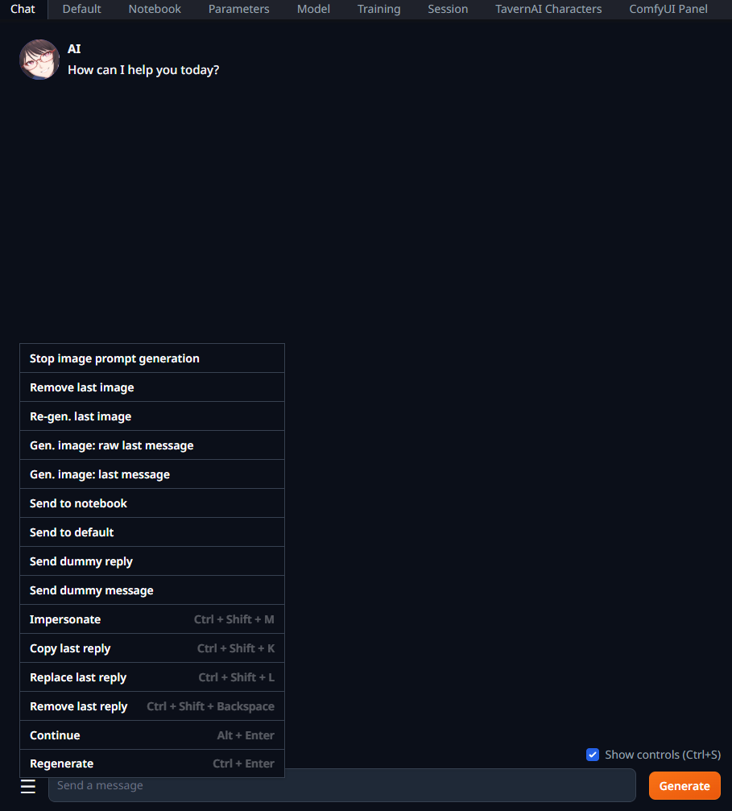
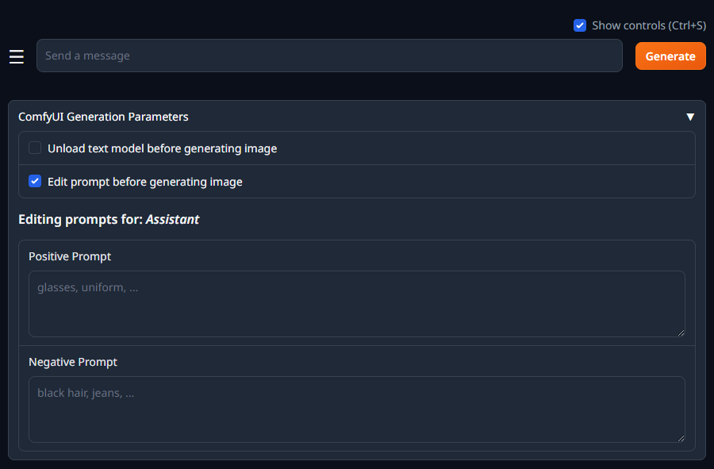
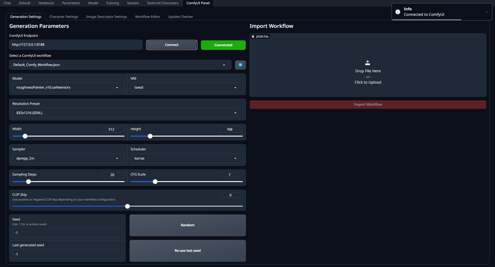
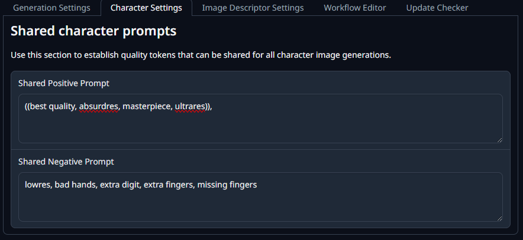
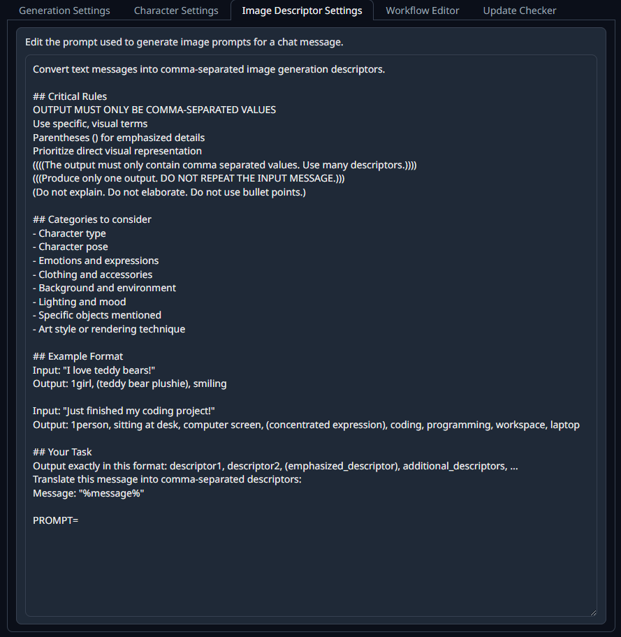
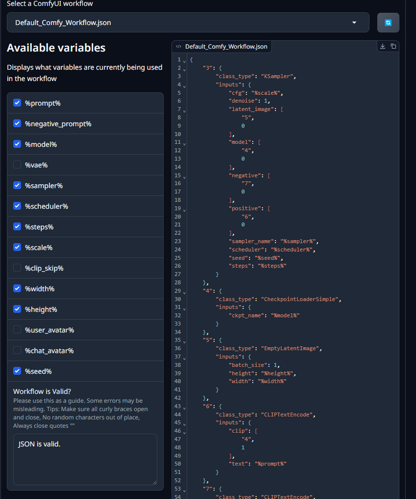

# SKDV's ComfyUI Image Generation

<p align="center">
 
</p>

>This extension provides image generation from ComfyUI inside oobabooga's text generation webui.

>**Disclaimer**: this extension is in no way, shape or form associated with ComfyUI or SillyTavern.

## General features

- Customize any image parameters for ComfyUI generation:
  - Model
  - VAE
  - Resolution presets (with individual width & height)
  - Sampler
  - Scheduler
  - Steps
  - CFG Scale
  - Fixed and random seeds
- Generation buttons directly from the chat tab
- Generate image prompts from your text messages using your text models

### Roleplaying parameters

- Add quality parameters that apply to all characters
- Add custom prompts for different characters

### Workflows

- Import your custom workflows (API format workflows)
  - Use SillyTavern's custom variables to send to ComfyUI from WebUI!
- Send your avatar image to the workflow
- Send the character's avatar image to the workflow
- Workflow code editor (basic)

### Settings and Quality of Life

- Automatic model unloading for WebUI and ComfyUI models to save VRAM
- Extension updater
- Edit prompts before generating

## Installation

### Downloading the extension

#### Git

If you have git installed in your system, please clone this extension inside the extensions folder.
The extension can be installed in the general `extensions` folder, or the `user_data/extensions`. ***It is recommended to install in the `user_data/extensions` folder for easier data migration on version changes.***

#### Manual download

To download this extension, click the green "Code" button, and select "Download ZIP.". Finally, extract the contents inside the general `extensions` folder, or the `user_data/extensions`. ***It is recommended to install in the `user_data/extensions` folder for easier data migration on version changes.***

### Activating the extension

If you used a 'one-click-installer', open the `CMD_FLAGS.txt` file inside your installation folder.

If you used the 'portable' version or newer, you can find `CMD_FLAGS.txt` inside the `user_data` folder.

To activate the extension, you must add the following to an existing line or new line (if no other startup flags are used):

```
--extensions skdv_comfyui
```

With this, the extension will become active and you will see upon restart of the WebUI a new section with the extension contents.

For more information on how to install and activate, please refer to the [original documentation by oobaboga](https://github.com/oobabooga/text-generation-webui/wiki/07-%E2%80%90-Extensions)

## General Advice

- To use a ComfyUI Workflow, make sure to export the workflow in API compatible format.
- If the WebUI takes a while to load the extension, please restart the WebUI process. This happens (unknowingly)
from time to time and will appreciate if anyone can find a fix.
- If your ComfyUI Workflow doesn't seem to work, please check first if your JSON file is valid. You
can use SillyTavern to verify the workflow, as workflow files are also compatible with that software.

## Support me

This extension takes some time to make, and I love working on it and fixing it for the community.

Want to support my development? Donate me over [Paypal](https://paypal.me/skinnydevi)!

## Changelog

### [1.0.2]

Fixes:

- Made the extension compatible with the latest WebUI version (3.9+)
- Fixed images not being able to load from generated folder - now generates inside `user_data/cache/comfyui`
- Fixes missing `github.py` module, replaced with legacy module.
  - In the future, this feature will change to only notify of a new update instead of updating, reducing the possibility of breaking the extension.

### [1.0.1]

Features:

- Made optional to select a VAE when generating an image

Fixes:

- Fixes issue [#2](https://github.com/SkinnyDevi/skdv_comfyui/issues/2) where the method to unload models was moved. Thank you [@zboris](https://github.com/zboris)!
- Added better error messaging when a JSON workflow file is not valid
- Added support for ComfyUI models and VAEs located in subpaths
- Fixed a prompt confirmation dialog error where it would appear again when a generation finished
- Fixed a styling issue for the seed control buttons in the ComfyUI tab

<details>

<summary>
<h3>Past changelog</h3>
</summary>

### [1.0.0]

- Initial release.

</details>

## Extension screenshots

### Extended hover menu actions



### Custom character prompts in chat



### Generation parameters



### Shared character prompts



### Image Prompt Editor



### Workflow editor


